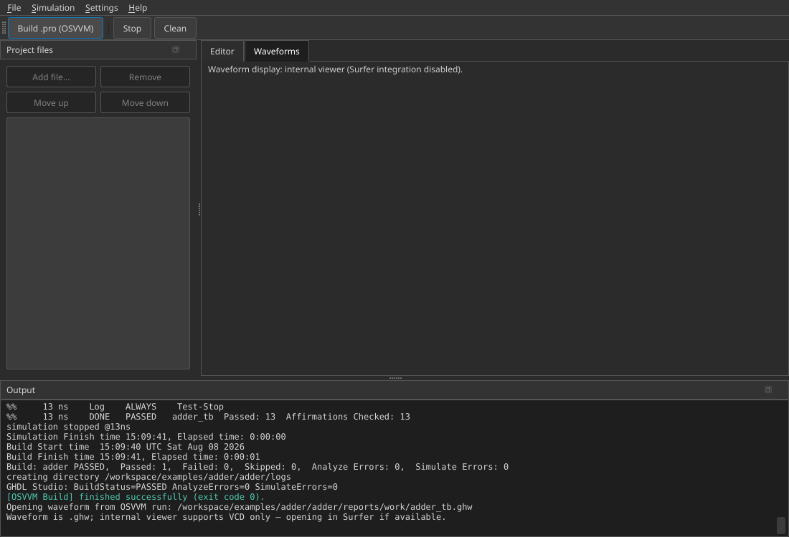

# GHDL Studio

A cross-platform graphical interface for [GHDL](https://ghdl.github.io/ghdl/),
the open-source VHDL simulator. Built with **Python** and **PySide6** (Qt for Python),
GHDL Studio runs unchanged on Linux, Windows and macOS.

On **every operating system** the interface uses a consistent dark theme
(Fusion style + dark palette), independent of the system appearance.

## Features (current status)

- **Startup mode selection** — when GHDL Studio opens, choose:
  - **Normal GHDL** — add source/data files manually, then Analyze / Elaborate / Run
    (same workflow as 0.3.x)
  - **OSVVM** — select a ``.pro`` script and run it with TCL
    (`source StartUp.tcl` + `build …pro`). Requires `tclsh` and an
    [OSVVM Scripts](https://github.com/OSVVM/OSVVM-Scripts) / OsvvmLibraries
    checkout. Paths are configured under Settings (**TCL executable**,
    **OSVVM Scripts path**). Use File → **Switch mode…** / **Open .pro…** later.
- Manage project files (add/remove, **Move up** / **Move down** for compile
  order): **VHDL** (`.vhd`/`.vhdl`), **Verilog/SystemVerilog** (`.v`/`.sv`), and
  **data/stimulus** files (`.txt`, `.csv`, `.dat`, `.hex`, …). Verilog and data
  files are colour-highlighted and skipped during `Analyze` (GHDL only analyses
  VHDL); data files still count toward the project root so layouts such as
  `input/ref_wave_data.txt` next to `output/` work with TB paths like
  `../input/…`
- Simple code editor with VHDL syntax highlighting for viewing/editing files
- **Choose the top-level entity with a click**: a toolbar on the main window shows a
  combo box of all VHDL entities found in the project files (updated automatically
  when files change); you can also type the name freely
- **Set the simulation stop time on the main window** (stop-time field in the same
  toolbar, e.g. `200ns`), without opening the settings dialog
- Asynchronous execution of GHDL commands via `QProcess` (does not block the GUI):
  - **Analyze** (`ghdl -a`)
  - **Elaborate** (`ghdl -e`)
  - **Run** (`ghdl -r`), including VCD and GHW export (`--vcd=` / `--wave=`), stop time and generics
  - Combined flow "Analyze + Elaborate + Run" (individual Analyze / Elaborate / Run
    buttons do **not** chain into the next step)
  - **Build .pro (OSVVM)** in OSVVM mode (`tclsh` + OSVVM Scripts)
  - After a successful OSVVM build, opens an **OSVVM Report** tab with the
    HTML summary (default `build/build_all/build_all.html` next to the `.pro`;
    configurable under **Settings → OSVVM HTML report** — absolute paths OK)
- **Dedicated output directory** (default `output/`, configurable in Settings):
  passed to GHDL as `--workdir`, and used as the process **cwd**, so the work
  library (`work-obj*.cf`), object files (`*.o`), waveform dumps (`*.vcd`/`*.ghw`),
  coverage data (`*.gcda`/`*.gcno`) and the elaborated simulation executable land
  there. Relative TB paths such as `../input/ref_wave_data.txt` therefore resolve
  next to `output/`. Via Simulation → **"Clean"** (also a toolbar button) you can
  clear the output directory at any time — similar to a `clean` target in a GHDL
  Makefile
- Before **Run**, **stages** project data/stimulus files into
  `<output>/../input/<filename>` (copy if needed) so `../input/…` opens succeed
  even when the source file lives elsewhere in the tree; the log shows the cwd and
  staging result
- Live log console shows GHDL output and **OSVVM transcript** lines (`%% … Log …`),
  including text that GHDL writes on stderr
- Before **Run**, creates the OSVVM report scaffold (`OsvvmTemp_GHDL/OsvvmRun.yml`)
  in the output directory (and project root) when missing (normally created by the
  OSVVM TCL flow)
- Live log console with colour coding (command / output / error / success)
- **Fully embedded [Surfer](https://surfer-project.org/)** in the "Waveforms" tab:
  If Surfer is installed, it is started automatically after each simulation run and its
  window is embedded natively in the GUI. Embedding works on **Linux/X11**
  (via `python-xlib` + `XReparentWindow`, including a full window-tree search; start prefers
  the Qt `xcb` plugin) and **Windows** (via WinAPI `SetParent`). On other platforms, or
  if Surfer is not found/disabled, a built-in
  **waveform viewer** is used as a fallback: a custom VCD parser with digital signals, bus values
  (as hex), a time ruler, and Zoom In / Zoom Fit / Zoom Out
- Settings dialog for the GHDL path and Surfer path (automatic detection via `PATH`
  or manual selection; Surfer integration can be enabled/disabled), the VHDL standard (87/93/00/02/08),
  optional **OSVVM lib path** / **Custom lib path** directories (Normal mode `-P`),
  plus **TCL executable** and **OSVVM Scripts path** for OSVVM `.pro` mode
- Configurable extra flags for GHDL builds with the GCC backend, pre-filled by default
  and adjustable in the settings dialog or reset with "Default":
  - `ghdl -a`: `-Wc,-fprofile-arcs -Wc,-ftest-coverage -fsynopsys -fPIE`
  - `ghdl -e`: `-Wl,-lgcov -fsynopsys -fPIE`
  - `ghdl -r`: `-fsynopsys`
- Settings are persisted across platforms via `QSettings`

## Project layout

```
src/ghdl_studio/
├── app.py                 # Entry point (mode dialog + MainWindow)
├── main_window.py          # Main window, Normal + OSVVM modes
├── ghdl_commands.py         # Pure helpers to build GHDL CLI arguments (Qt-free, testable)
├── osvvm_commands.py        # OSVVM .pro / tclsh helpers (Qt-free, testable)
├── ghdl_runner.py            # Asynchronous process execution via QProcess
├── vcd_parser.py             # Minimal VCD parser + time formatting (Qt-free, testable)
├── vhdl_scanner.py            # Detection of VHDL entities / Verilog modules (Qt-free, testable)
├── surfer_embed.py             # Native embedding of the Surfer window (Linux/X11, Windows)
├── theme.py                   # Dark Fusion theme (cross-platform)
├── settings.py                # Persistent settings (QSettings)
└── widgets/
    ├── file_explorer.py       # Project file management
    ├── log_console.py          # Colour-coded output console
    ├── code_editor.py           # Text editor for VHDL files
    ├── vhdl_highlighter.py       # VHDL syntax highlighting
    ├── waveform_viewer.py         # Fallback waveform view from VCD data, including time ruler
    ├── startup_mode_dialog.py     # Normal vs OSVVM mode at startup
    └── run_settings_dialog.py     # Settings dialog (GHDL/Surfer/TCL/OSVVM paths)

examples/counter/            # Example: simple counter + basic testbench
examples/adder/              # Example: combinational adder + OSVVM testbench
tests/                        # Unit tests for the Qt-independent modules
```

### OSVVM mode (``.pro`` files)

1. Install TCL: `sudo apt install tcl` (provides `tclsh`)
2. Clone / install [OSVVM](https://github.com/OSVVM) libraries so that
   `…/OsvvmLibraries/Scripts/StartUp.tcl` exists
   ([OSVVM-Scripts](https://github.com/OSVVM/OSVVM-Scripts))
3. In GHDL Studio **Settings**, set:
   - **TCL executable** → `tclsh` (or Detect automatically)
   - **OSVVM Scripts path** → `…/OsvvmLibraries/Scripts` or `…/OsvvmLibraries`
4. At startup choose **OSVVM mode** and select your ``.pro`` file
5. **Simulation → Build .pro (OSVVM)** runs
   `source StartUp.tcl` then `build <your.pro>`
6. If the script writes a ``.ghw``/``.vcd`` next to the ``.pro``, GHDL Studio
   tries to open it in Surfer / the Waveforms tab

Normal mode still supports OSVVM VHDL testbenches via **OSVVM lib path** (`-P`)
and Analyze → Elaborate → Run (see the adder example below).

## Requirements

- Python 3.9 or newer
- **Linux/WSL (Qt-xcb for Surfer embedding):** additionally
  ```bash
  sudo apt install libxcb-cursor0
  ```
  Without this package, Qt 6.5+ will not start with the xcb plugin
  (`xcb-cursor0 or libxcb-cursor0 is needed`). GHDL Studio then tries
  to start without forcing xcb (GUI runs; Surfer embedding may not).
- [GHDL](https://ghdl.github.io/ghdl/getting.html) must be installed and on the `PATH`
  (or set the path manually in the GUI settings).
  - Linux: via the package manager (e.g. `apt install ghdl`) or from GitHub releases
  - Windows: ready-made binary packages from the [GHDL releases page](https://github.com/ghdl/ghdl/releases)
  - macOS: via [Homebrew](https://formulae.brew.sh/formula/ghdl) (`brew install ghdl`)
- **Optional, but recommended:** [Surfer](https://surfer-project.org/) for the full
  embedded waveform display (see above). Without Surfer the GUI still works
  fully via the built-in fallback viewer.
  - **Recommended (no Rust/Cargo):** download pre-built binaries.
    On **Ubuntu 22.04 / WSL** please use the **Rocky Linux binary** — the normal
    `surfer_linux_*.zip` often needs GLIBC ≥ 2.38/2.39 and will not start there.
    ```bash
    mkdir -p ~/.local/bin
    curl -L -o /tmp/surfer_linux_rocky.zip \
      "https://gitlab.com/api/v4/projects/42073614/jobs/artifacts/main/raw/surfer_linux_rocky.zip?job=rocky_build"
    unzip -o /tmp/surfer_linux_rocky.zip -d /tmp/surfer_extract
    install -m 755 /tmp/surfer_extract/surfer ~/.local/bin/surfer
    # Persist PATH if needed:
    grep -q '\$HOME/.local/bin' ~/.bashrc || echo 'export PATH="$HOME/.local/bin:$PATH"' >> ~/.bashrc
    source ~/.bashrc
    surfer --version
    ```
    Newer distros (e.g. Ubuntu 24.04) can instead use the release zips from
    [Surfer releases](https://gitlab.com/surfer-project/surfer/-/releases)
    (`surfer_linux_v*.zip`).
    Windows: extract `surfer_win_*.zip` from the same page and add the folder containing
    `surfer.exe` to `PATH`, or enter the full path in the GHDL Studio settings.
  - **Alternative from source** (requires Rust): first install
    [rustup](https://rustup.rs/), then
    `cargo install --git https://gitlab.com/surfer-project/surfer.git surfer`
  - On Linux the Python package `python-xlib` is also required to embed Surfer
    (installed automatically with `pip install -r requirements.txt`)
  - Further details: [Surfer documentation](https://docs.surfer-project.org/book/)

### Troubleshooting: Surfer embedding

Surfer may open as a **standalone** window (the simulation is not
affected) but is not embedded in the "Waveforms" tab. Possible causes:

1. **Surfer not on PATH.** Use "Detect automatically" in Settings, or set the
   path to the `surfer` executable manually.
2. **`python-xlib` missing** (Linux only). In the activated venv run
   `pip install -r requirements.txt` again.
3. **Slow window manager/compositor** (e.g. under WSLg): click
   "Retry Surfer".
4. **Surfer embedding reports `currently: wayland`:** Embedding needs Qt-xcb.
   Often `export QT_QPA_PLATFORM=wayland` is still set in the shell (an earlier workaround).
   ```bash
   sudo apt install libxcb-cursor0 libxcb-xinerama0 libxcb-icccm4 \
     libxcb-image0 libxcb-keysyms1 libxcb-render-util0 libxcb-shape0 \
     libxcb-randr0 libxkbcommon-x11-0 libxcb-util1
   unset QT_QPA_PLATFORM
   # xcb test (must run without aborting):
   QT_QPA_PLATFORM=xcb python3 -c "from PySide6.QtWidgets import QApplication; print(QApplication([]).platformName())"
   git pull origin cursor/ghdl-gui-pyside6-scaffold-85f1
   pip install -e .
   ghdl-studio
   ```
   The app prefers xcb automatically once the probe succeeds — even if
   `QT_QPA_PLATFORM=wayland` was set before. Force Wayland only if needed with
   `export GHDL_STUDIO_PREFER_WAYLAND=1`.
5. **`platform plugin does not support foreign windows` (WSL/Wayland):** At start, GHDL Studio
   automatically sets `QT_QPA_PLATFORM=xcb` if `libxcb-cursor` is found.
   Fully restart the app. If `QT_QPA_PLATFORM=wayland` is set manually:
   temporarily `export QT_QPA_PLATFORM=xcb` (after installing `libxcb-cursor0`).
6. **Windows: empty tab, Surfer stays external:** Embedding uses `SetParent` with
   correct 32-bit `LONG` normalisation — pull the current branch and retest.
7. **Linux/WSL: status "Surfer (embedded)", but empty tab:** Surfer is a GPU app
   (wgpu); after `XReparentWindow` the content often stays black under WSLg/XWayland.
   The current code prefers `QWindow.createWindowContainer` under xcb. Please
   pull the branch and retest. If the tab stays empty, use Surfer as a separate window
   (the internal viewer still shows the waves) — under native Windows,
   embedding is more reliable.

## Installation

### Development install (editable)

```bash
python3 -m venv .venv
source .venv/bin/activate   # Windows: .venv\Scripts\activate
pip install -r requirements.txt
pip install -e .
```

`pip install -e .` installs the `ghdl_studio` package in **editable** mode
(source changes take effect immediately). It is required for
`python -m ghdl_studio` / `ghdl-studio` during development. Without it, startup
fails with `No module named ghdl_studio`, because `requirements.txt` only
installs dependencies, not the project itself.

### Permanent install (Linux / WSL)

For day-to-day use, install into a dedicated virtualenv with a normal
(non-editable) `pip install .` and put that venv on your `PATH`. You can then
run `ghdl-studio` from any directory without activating a project-local `.venv`.

Prerequisites: Python 3.9+ and GHDL on `PATH` (e.g. `sudo apt install ghdl`).

```bash
# Clone (or use an existing checkout)
git clone https://github.com/3NT3RTAiN3R26/GHDL-STUDIO.git
cd GHDL-STUDIO
git checkout main
git pull

# Dedicated venv (lives outside the repo)
python3 -m venv ~/.venvs/ghdl-studio
source ~/.venvs/ghdl-studio/bin/activate
pip install -U pip
pip install .

# Persist PATH so `ghdl-studio` works in new shells
grep -q '\.venvs/ghdl-studio/bin' ~/.bashrc || \
  echo 'export PATH="$HOME/.venvs/ghdl-studio/bin:$PATH"' >> ~/.bashrc
source ~/.bashrc

# Launch from any directory
ghdl-studio
```

**Upgrade later:**

```bash
cd GHDL-STUDIO
git pull
source ~/.venvs/ghdl-studio/bin/activate
pip install .
```

`pip install -e .` is for development only; `pip install .` is the permanent
install. Keep the venv (and optionally the clone for upgrades); you do not need
to activate the project directory’s `.venv` each time.

## Launch

```bash
python -m ghdl_studio
```

or, after install:

```bash
ghdl-studio
```

Show the installed version (no GUI):

```bash
ghdl-studio --version
# or: ghdl-studio -V
```

The same version string appears under **Help → About GHDL Studio**.

## Try the example projects

### Counter (built-in testbench)

1. Start the GUI
2. Via "Project files" → "Add file..." add the files from `examples/counter/`
   (`counter.vhd`, then `counter_tb.vhd` — order is the compile order)
3. In the toolbar click the "Top-level entity" drop-down arrow and
   select `counter_tb`; optionally enter a stop time such as `200ns`
4. If needed, check the GHDL and Surfer paths in Settings (button
   "Detect automatically")
5. Menu "Simulation" → "Analyze + Elaborate + Run"
6. After a successful run the view switches to the "Waveforms" tab (Surfer if
   available, otherwise the built-in fallback viewer)

### Adder (OSVVM testbench)

Files in `examples/adder/`:

| File | Role |
|------|------|
| `adder.vhd` | DUT |
| `adder_tb.vhd` | OSVVM AffirmIfEqual testbench |
| `adder.pro` | OSVVM Scripts build (for **OSVVM mode**) |

#### Normal GHDL mode (manual files + `-P`)

1. Precompile OSVVM for GHDL (vendor script or OSVVM TCL) and set
   **Settings → OSVVM lib path** to the directory that contains the compiled
   OSVVM libraries (`-P` search path)
2. Add `examples/adder/adder.vhd`, then `examples/adder/adder_tb.vhd`
3. Select top-level entity `adder_tb` (stop time can stay empty — the TB calls
   `std.env.stop`)
4. Analyze → Elaborate → Run
5. The Output dock shows OSVVM transcript lines (`%% … Log … PASSED …`);
   GHDL Studio also creates `OsvvmTemp_GHDL/OsvvmRun.yml` in the project
   directory before Run if it is missing

#### OSVVM mode (`.pro` / TCL)

1. Install `tclsh` and clone [OsvvmLibraries](https://github.com/OSVVM/OsvvmLibraries)
   **with submodules** (needs the `osvvm` utility library):
   ```bash
   git clone --recursive https://github.com/OSVVM/OsvvmLibraries
   # or, if already cloned:  cd OsvvmLibraries && git submodule update --init osvvm
   ```
2. Settings → **TCL executable** + **OSVVM Scripts path**
   (`…/OsvvmLibraries/Scripts` or `…/OsvvmLibraries`)
3. At startup choose **OSVVM mode** and select `examples/adder/adder.pro`
4. **Simulation → Build .pro (OSVVM)** — the `.pro` first `include`s
   `OsvvmLibraries/osvvm`, then analyzes/simulates `adder_tb`
   (`SetSaveWaves` writes a `.ghw` when possible). The first build compiles
   OSVVM and takes longer; later runs reuse `VHDL_LIBS/`.
5. After a successful build, the **OSVVM Report** tab loads the HTML report
   from **Settings → OSVVM HTML report** (default
   `build/build_all/build_all.html` relative to the `.pro` directory; absolute
   paths are supported). Use **Simulation → Open OSVVM HTML report** to reopen
   it. Example absolute path:
   `…/test/vhdl/build/build_all/build_all.html`.

Successful **OSVVM mode** run of `examples/adder/adder.pro`
(**Build .pro (OSVVM)** — 13 affirmations passed, exit code 0):



## Development & tests

The modules `ghdl_commands.py` and `vcd_parser.py` have no Qt dependencies and
are fully testable with `pytest` (even without GHDL installed):

```bash
pip install -r requirements-dev.txt
pytest
```

## Design choice: Python + PySide6

PySide6 (the official Qt for Python bindings) was chosen because:

- Qt looks and behaves natively on Linux, Windows and macOS
- `QProcess` provides non-blocking process control integrated into the event loop
  (important because GHDL runs can take several seconds depending on simulation length)
- Python speeds up development of parsing logic (VCD, GHDL output) and GUI code
- The LGPL licence of PySide6 allows straightforward use in proprietary projects as well

## Licence

See [LICENSE](LICENSE).
