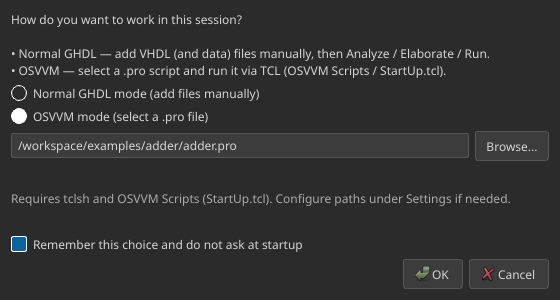

# Getting started

## Requirements

- **Python** 3.9 or newer (not needed for the Windows portable `.exe`)
- **GHDL** on `PATH` (or set the path in Settings)
- Optional: **Surfer** for embedded waveforms
- Optional (OSVVM mode): **tclsh** and an
  [OsvvmLibraries](https://github.com/OSVVM/OsvvmLibraries) checkout (with `osvvm` submodule)

On Linux/WSL, Surfer embedding needs an X11/`xcb` capable session
(`libxcb-cursor0` on Ubuntu/Debian).

## Windows portable

1. Download `GHDL-Studio-windows-portable-*.zip` from the
   [Windows portable](https://github.com/3NT3RTAiN3R26/GHDL-STUDIO/actions/workflows/windows-portable.yml)
   Actions artifact on `main`.
2. Unzip and run `GHDL-Studio\GHDL-Studio.exe` (startup mode dialog; no Python).
3. Install **GHDL** (and optionally Surfer / tclsh) separately — they are not
   inside the zip.

`GHDL-Studio.exe --version` and **Help → About** match the project version
(**1.0.0**).

## Install (from source)

```bash
git clone https://github.com/3NT3RTAiN3R26/GHDL-STUDIO.git
cd GHDL-STUDIO
python -m venv .venv
source .venv/bin/activate   # Windows: .venv\Scripts\activate
pip install -r requirements.txt
pip install -e .
```

## Launch

```bash
ghdl-studio
# or
python -m ghdl_studio
```

Show the version (no GUI):

```bash
ghdl-studio --version
```

## First launch

1. The **startup dialog** asks for Normal or OSVVM mode.
2. Tick **Remember this choice** if you want to skip the dialog next time
   (change later via **File → Switch mode…**).
3. Open **Settings** and verify **GHDL executable** (and Surfer / TCL / OSVVM paths as needed).

{ width="480" }

## Platform notes

| Platform | Notes |
|----------|--------|
| **Linux** | Preferred for Surfer X11 embedding |
| **WSL** | Same app build; Surfer embedding needs WSLg / X11 |
| **Windows** | Native PySide6 UI or **portable `.exe`** (PyInstaller); Surfer via WinAPI `SetParent`; OSVVM Scripts get `which`/`ghdl` shims for paths with spaces |
