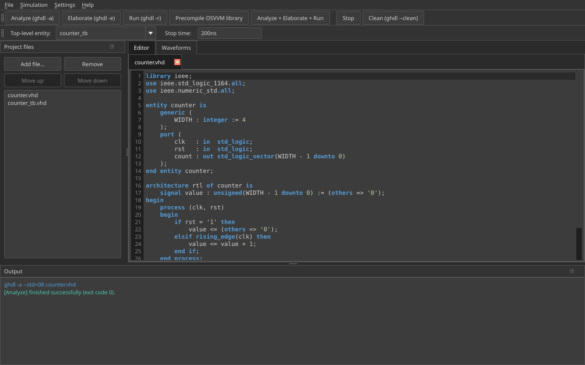

# Normal mode

Use Normal mode when you manage VHDL (and optional Verilog / data) files yourself
and drive GHDL with **Analyze → Elaborate → Run**.

{ width="900" }

## Project files

In the **Project files** dock:

1. **Add file…** — VHDL (`.vhd`/`.vhdl`), Verilog/SystemVerilog (`.v`/`.sv`), or data/stimulus files
2. **Move up / Move down** — compile order for `ghdl -a` (VHDL only)
3. Double-click a file to open it in the **Editor** tab

Verilog and data files are colour-marked and skipped during Analyze; data files
still help locate the project root so paths like `../input/…` work.

## Toolbar

| Control | Purpose |
|---------|---------|
| **Top-level entity** | Entity for Elaborate / Run (auto-filled from scanned VHDL) |
| **Stop time** | Optional `--stop-time=` for Run (e.g. `200ns`) |
| **Generics…** | Optional `-gNAME=value` overrides for Run (saved in `.ghdlstudio`) |
| **Analyze / Elaborate / Run** | Individual GHDL steps (do not auto-chain) |
| **Analyze + Elaborate + Run** | Full chain |
| **Precompile OSVVM library…** | Build `osvvm` for Normal-mode `-P` |
| **Clean** | `ghdl --clean` + clear Studio `output/` in Normal mode |

## Editor

- Line numbers
- Syntax highlighting for **VHDL** and **Verilog / SystemVerilog**
- Save with **Ctrl+S** / **File → Save**

## Output & waveforms

The **Output** dock shows colour-coded GHDL (and OSVVM transcript) lines.

After a successful Run, GHDL Studio opens the waveform in the **Waveforms** tab:

- **Surfer** embedded when found and enabled in Settings
- otherwise the built-in VCD viewer

## Output directory

Default work directory is `output/` (configurable). Relative testbench paths
such as `../input/ref_wave_data.txt` resolve next to that folder. Studio also
stages project data files into `<output>/../input/` before Run when needed.
