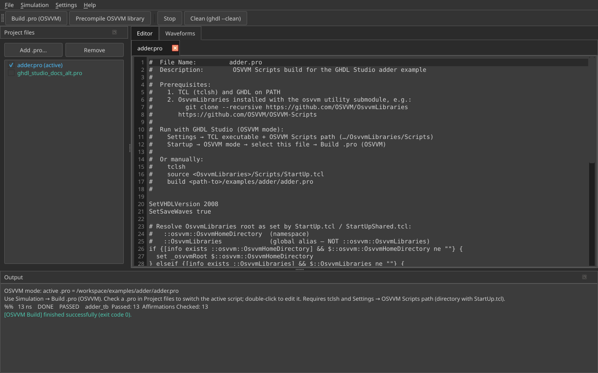
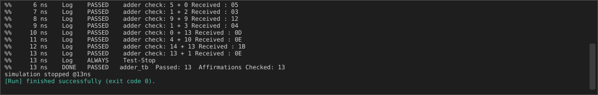

# OSVVM mode

OSVVM mode runs project scripts (`.pro`) through `tclsh` and
[OSVVM Scripts](https://github.com/OSVVM/OSVVM-Scripts)
(`source StartUp.tcl` → `build <active.pro>`).

{ width="900" }

## Multiple `.pro` files (0.6.0)

The **Project files** dock lists OSVVM scripts instead of HDL sources:

- **Add .pro…** — add one or more scripts
- **Checkbox** — exactly one script is **active** (used by **Build .pro**)
- **Move up / Move down** — hidden in OSVVM mode
- **Double-click** — open the script in the **Editor** tab
- The list is remembered across sessions (with the active path)

!!! tip
    Switch the active `.pro` with the checkbox before **Simulation → Build .pro (OSVVM)**.
    Use **File → Open .pro…** to add a script, make it active, and open it in the editor.

## Prerequisites

1. Install TCL (`tclsh`)
2. Clone OsvvmLibraries **with submodules**:

    ```bash
    git clone --recursive https://github.com/OSVVM/OsvvmLibraries
    ```

3. In **Settings**, set:
    - **TCL executable**
    - **OSVVM Scripts path** → `…/OsvvmLibraries/Scripts` (or the library root)

## Build flow

1. Start in OSVVM mode (or **File → Switch mode…** / **Open .pro…**)
2. Ensure the desired `.pro` is checked as **(active)**
3. **Simulation → Build .pro (OSVVM)**
4. On success, Studio may open:
    - an **OSVVM Report** tab (HTML summary)
    - a waveform next to the `.pro` (`.ghw` / `.vcd`) when available

### Real run (adder example)

{ width="900" }

Colour-coded OSVVM transcript lines in the Output dock:

{ width="700" }

## Precompile OSVVM library

Available in **both** modes. Compiles `osvvm` (RandomPkg, …) into
`VHDL_LIBS/GHDL-*` so Normal mode can use **OSVVM lib path (-P)** for
`use osvvm.RandomPkg.all`.

## Windows / mcode notes

- Official Windows GHDL is often **mcode**. Studio detects mcode and forces
  coverage off so OSVVM `-Wl,-lgcov` / `-o` options do not break the run.
- `cannot load package "randompkg"` → precompile into your `osvvm_ghdl` tree
  (or fix **OSVVM lib path**), then rebuild.
