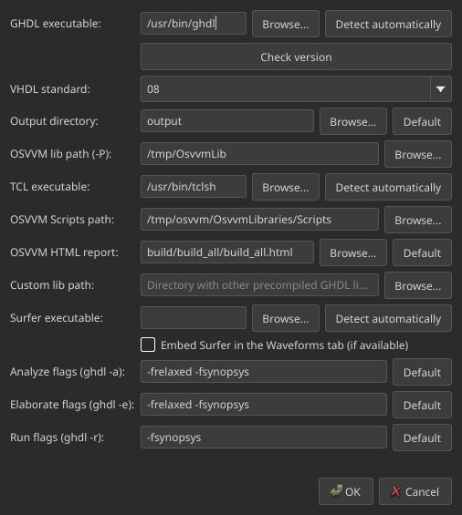

# Settings

Open **Settings → Settings…** (or the Preferences entry) to configure tools and
GHDL flags. Values persist via `QSettings` on every platform.

{ width="420" }

## Paths

| Setting | Role |
|---------|------|
| **Tool backend** | Windows only: **Native** or **WSL** (`wsl.exe` + `/mnt/c/…` paths) |
| **GHDL executable** | Simulator binary (`Detect automatically` / Check version) |
| **VHDL standard** | `87` / `93` / `00` / `02` / `08` |
| **Output directory** | Workdir for Normal mode (`--workdir` + process cwd) |
| **OSVVM lib path (-P)** | Precompiled OSVVM library for Normal Analyze/Elaborate/Run |
| **Custom lib path** | Extra `-P` directory |
| **TCL executable** | Required for OSVVM `.pro` builds |
| **OSVVM Scripts path** | Directory containing `StartUp.tcl` |
| **OSVVM HTML report** | Preferred report after Build; if missing, auto-detect next to `.pro` |
| **Surfer executable** | Waveform tool; optional embed into the Waveforms tab |

## Extra GHDL flags

Defaults favour GCC-backend coverage-friendly builds and can be reset with
**Default**:

- **Analyze** (`ghdl -a`)
- **Elaborate** (`ghdl -e`)
- **Run** (`ghdl -r`)

Adjust these if your GHDL backend (mcode / llvm / gcc) needs different options.
